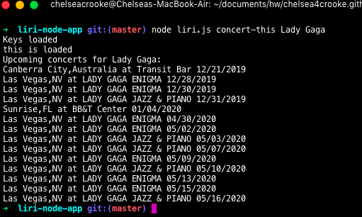
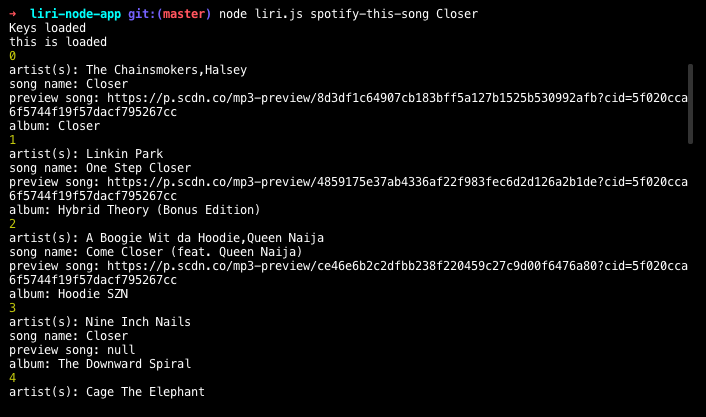
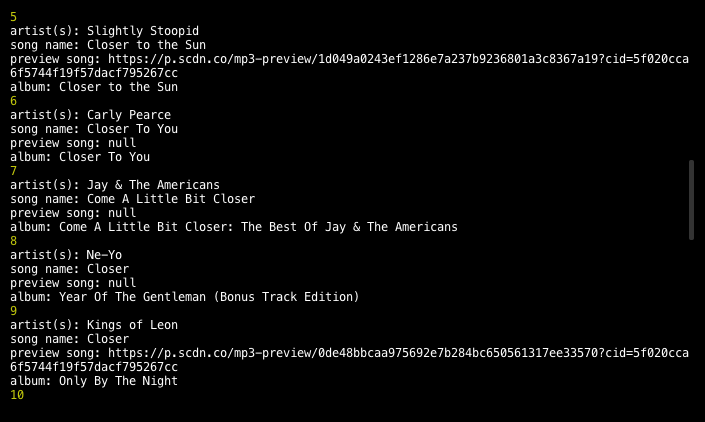
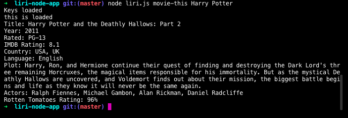
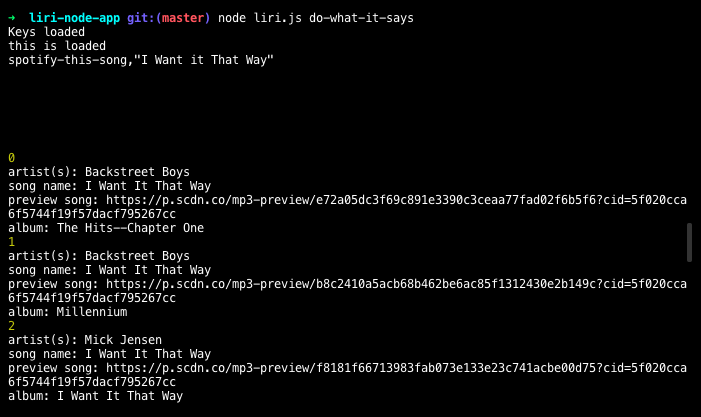
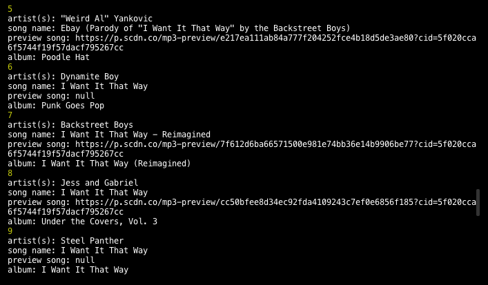

# **Liri-Bot**

###### **Node.js Assignment**

## **About the App:**
LIRI is a Language Interpretation and Recognition Interface and is a command line node app. It takes in parameters and gives back data. There is an option of four commands used in combination with parameters associated with the commands:
    
    1. concert-this
    2. spotify-this-song
    3. movie-this
    4. do-what-it-says       

### **How to use Liri-Bot:**

#### **Step by Step Instructions:**
    1. Open terminal.
    2. Navigate to the folder containing the liri.js file.
    3. Depending on the command line you run, the output will vary.

#### **Summary:**

Liri-Bot connects with the Spotify Api, runs the commands and outputs the User desired results.

#### **Deployed Version Link:**
(..github link)

### **Technologies Used:**

    1. Javascript
    2. Node.js
    3. Node packages: Node-Spotify Api, Request, Moment, DotEnv
    4. API's used: Bands in Town, OMDB
    5. Git
    6. Github

#### **Command Executions:**

    1. Node liri.js Spotify-this-song
    2. Node liri.js concert-this
    3. Node liri.js movie-this
    4. Node liri.js do-what-it-says
